# Daily Reflection Tree — Visual Diagram

```mermaid
flowchart TD
    START(["🌙 START\nGood evening. Take a breath.\nLet's look at your day."])
    START --> A1_OPEN

    A1_OPEN{{"❓ Q1 — AXIS 1: LOCUS\nIf you had to describe today\nin one word, what would it be?\n[Productive | Tough | Mixed | Frustrating]"}}
    A1_OPEN --> A1_D1

    A1_D1{"Decision\nRoute by answer"}
    A1_D1 -->|"Productive or Mixed"| A1_Q_HIGH
    A1_D1 -->|"Tough or Frustrating"| A1_Q_LOW

    A1_Q_HIGH{{"❓ Q2a\nWhen something went well today,\nwhat made it happen?\n[Prepared | Adapted | Timing | Others]"}}
    A1_Q_LOW{{"❓ Q2b\nWhen things got difficult,\nwhat was your first instinct?\n[Control | Push through | Wait | Stuck]"}}

    A1_Q_HIGH --> A1_Q_AGENCY_FOLLOWUP
    A1_Q_LOW  --> A1_Q_AGENCY_FOLLOWUP

    A1_Q_AGENCY_FOLLOWUP{{"❓ Q3\nWas there a moment today where\nyou made a decision that changed\nhow something unfolded?\n[Yes+difference | Yes+unsure | Maybe | Not really]"}}
    A1_Q_AGENCY_FOLLOWUP --> A1_D2

    A1_D2{"Decision\naxis1.dominant"}
    A1_D2 -->|"internal ≥ external"| A1_R_INT
    A1_D2 -->|"external > internal"| A1_R_EXT

    A1_R_INT[["💭 Reflection — Internal Locus\nYou stayed in the driver's seat today.\nThat's agency — and it compounds."]]
    A1_R_EXT[["💭 Reflection — External Locus\nSomewhere in that day, you made\nat least one call. It wasn't insignificant."]]

    A1_R_INT --> BRIDGE_1_2
    A1_R_EXT --> BRIDGE_1_2

    BRIDGE_1_2["➡️ BRIDGE 1→2\nNow let's shift — from how you\nhandled today, to what you gave."]
    BRIDGE_1_2 --> A2_OPEN

    A2_OPEN{{"❓ Q4 — AXIS 2: ORIENTATION\nThink about one interaction today.\nWhich best describes it?\n[Helped | Taught | Unrecognized | Others not contributing]"}}
    A2_OPEN --> A2_D1

    A2_D1{"Decision\nRoute by answer"}
    A2_D1 -->|"A or B"| A2_Q_CONTRIB_FOLLOW
    A2_D1 -->|"C or D"| A2_Q_ENT_FOLLOW

    A2_Q_CONTRIB_FOLLOW{{"❓ Q5a\nWhen you helped today,\nwhat was driving it?\n[Right thing | Enjoy it | Hoping noticed | Obligated]"}}
    A2_Q_ENT_FOLLOW{{"❓ Q5b\nWas there a moment you gave\nsomething without expecting return?\n[Yes+good | Yes+unnoticed | Didn't look | Nothing left]"}}

    A2_Q_CONTRIB_FOLLOW --> A2_D2
    A2_Q_ENT_FOLLOW     --> A2_D2

    A2_D2{"Decision\naxis2.dominant"}
    A2_D2 -->|"contribution ≥ entitlement"| A2_R_CONTRIB
    A2_D2 -->|"entitlement > contribution"| A2_R_ENT

    A2_R_CONTRIB[["💭 Reflection — Contribution\nToday you were a giver. Your\nenergy went outward. That changes things."]]
    A2_R_ENT[["💭 Reflection — Entitlement\nToday's lens tilted inward.\nJust notice which way it was pointing."]]

    A2_R_CONTRIB --> BRIDGE_2_3
    A2_R_ENT     --> BRIDGE_2_3

    BRIDGE_2_3["➡️ BRIDGE 2→3\nOne more lens — who else was\nin your field of vision today?"]
    BRIDGE_2_3 --> A3_OPEN

    A3_OPEN{{"❓ Q6 — AXIS 3: RADIUS\nWhen today's biggest challenge\ncomes to mind, who were you thinking about?\n[Myself | My team | A colleague | The customer]"}}
    A3_OPEN --> A3_D1

    A3_D1{"Decision\nRoute by answer"}
    A3_D1 -->|"A (myself)"| A3_Q_SELF_FOLLOW
    A3_D1 -->|"B, C, or D"| A3_Q_ALT_FOLLOW

    A3_Q_SELF_FOLLOW{{"❓ Q7a\nDid anyone else's experience\ncross your mind?\n[Noticed team | Briefly | Survival mode | No]"}}
    A3_Q_ALT_FOLLOW{{"❓ Q7b\nHow did holding others in mind\naffect your own experience?\n[Purpose | Grounded | Pressure | Practical]"}}

    A3_Q_SELF_FOLLOW --> A3_D2
    A3_Q_ALT_FOLLOW  --> A3_D2

    A3_D2{"Decision\naxis3.dominant"}
    A3_D2 -->|"altrocentric ≥ selfcentric"| A3_R_ALT
    A3_D2 -->|"selfcentric > altrocentric"| A3_R_SELF

    A3_R_ALT[["💭 Reflection — Altrocentric\nYou held more than your own experience.\nThat outward awareness shapes environments."]]
    A3_R_SELF[["💭 Reflection — Self-Centric\nYour frame stayed close to you today.\nThat's where all self-awareness begins."]]

    A3_R_ALT  --> SUMMARY
    A3_R_SELF --> SUMMARY

    SUMMARY[/"📋 SUMMARY\nToday you showed up as someone who {axis1_label}.\nWhen it came to giving, you were {axis2_label}.\nYour field of vision {axis3_label}.\n\nThat's today. Tomorrow is a fresh read."/]
    SUMMARY --> END

    END(["🌙 END\nSee you tomorrow. Rest well."])

    %% Styling
    style START fill:#3b82f6,color:#fff,stroke:#2563eb
    style END   fill:#3b82f6,color:#fff,stroke:#2563eb
    style BRIDGE_1_2 fill:#fef9c3,stroke:#ca8a04
    style BRIDGE_2_3 fill:#fef9c3,stroke:#ca8a04
    style SUMMARY    fill:#dcfce7,stroke:#16a34a
    style A1_R_INT   fill:#e0f2fe,stroke:#0284c7
    style A1_R_EXT   fill:#e0f2fe,stroke:#0284c7
    style A2_R_CONTRIB fill:#e0f2fe,stroke:#0284c7
    style A2_R_ENT     fill:#e0f2fe,stroke:#0284c7
    style A3_R_ALT     fill:#e0f2fe,stroke:#0284c7
    style A3_R_SELF    fill:#e0f2fe,stroke:#0284c7
```

## Node Map Summary

| Node ID | Type | Axis | Description |
|---------|------|------|-------------|
| START | start | — | Session opener |
| A1_OPEN | question | 1 | "Describe today in one word" |
| A1_D1 | decision | 1 | Route: Productive/Mixed → HIGH, Tough/Frustrating → LOW |
| A1_Q_HIGH | question | 1 | "What made things go well?" |
| A1_Q_LOW | question | 1 | "First instinct when things got hard?" |
| A1_Q_AGENCY_FOLLOWUP | question | 1 | "Did you make a decision that changed something?" |
| A1_D2 | decision | 1 | Route: axis1.dominant → INT or EXT reflection |
| A1_R_INT | reflection | 1 | Internal locus reflection |
| A1_R_EXT | reflection | 1 | External locus reflection |
| BRIDGE_1_2 | bridge | — | Transition Axis 1 → 2 |
| A2_OPEN | question | 2 | "Describe one interaction today" |
| A2_D1 | decision | 2 | Route: A/B → contribution follow-up, C/D → entitlement follow-up |
| A2_Q_CONTRIB_FOLLOW | question | 2 | "What drove your contribution?" |
| A2_Q_ENT_FOLLOW | question | 2 | "Any moment of giving without expectation?" |
| A2_D2 | decision | 2 | Route: axis2.dominant → CONTRIB or ENT reflection |
| A2_R_CONTRIB | reflection | 2 | Contribution orientation reflection |
| A2_R_ENT | reflection | 2 | Entitlement orientation reflection |
| BRIDGE_2_3 | bridge | — | Transition Axis 2 → 3 |
| A3_OPEN | question | 3 | "Who were you thinking about during today's challenge?" |
| A3_D1 | decision | 3 | Route: A → self follow-up, B/C/D → altrocentric follow-up |
| A3_Q_SELF_FOLLOW | question | 3 | "Did anyone else cross your mind?" |
| A3_Q_ALT_FOLLOW | question | 3 | "How did holding others in mind affect you?" |
| A3_D2 | decision | 3 | Route: axis3.dominant → ALT or SELF reflection |
| A3_R_ALT | reflection | 3 | Altrocentric reflection |
| A3_R_SELF | reflection | 3 | Self-centric reflection |
| SUMMARY | summary | — | End-of-session synthesis using accumulated state |
| END | end | — | Session close |
